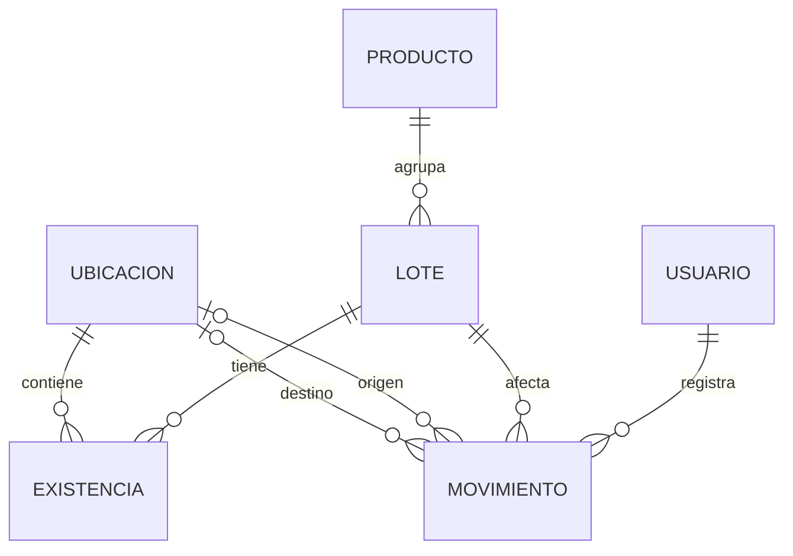

# ZAV 2026 — Modelo de datos mínimo y reglas de integridad

**Estado:** diseño técnico para E2; no representa tablas implementadas ni pruebas superadas.  
**Alcance funcional E2:** autenticación del Administrador, registro/consulta de productos terminados y lotes, e ingreso inicial persistente.  
**Trazabilidad:** RF-02 (acceso), RF-03 (productos), RF-04 (lotes e ingresos); prepara RF-05 (traslados), RF-08 (pedidos) y RF-10 (retiro).

## 1. Decisiones y justificación

1. Se usará PostgreSQL con un modelo relacional, transacciones, restricciones y migraciones versionadas. Para NestJS se utilizará TypeORM con `@nestjs/typeorm` y el controlador `pg`; **`synchronize: false`** en todos los entornos. Alternativas revisadas: consultas SQL directas (más control, más código repetitivo para entidades y repositorios) y Prisma (cliente tipado, pero un mecanismo de integración y migraciones distinto). TypeORM permite una integración mantenida por NestJS y manejo de repositorios y transacciones. La decisión se evaluará si aparecen incompatibilidades verificadas.
2. Una fila de `producto` corresponde a **una presentación comercial**. Dos paquetes del mismo alimento con pesos distintos son dos productos distintos; `peso_gramos` es fijo y entero positivo. La unidad base del inventario en esta versión es el paquete o unidad comercial completa.
3. `lote` identifica una partida de **un único producto/presentación**. No almacena un campo modificable de cantidad actual.
4. `ubicacion` diferencia la custodia física: `PRODUCCION_ALMACENAMIENTO`, `VENTA_DESPACHO`; las ubicaciones lógicas `EN_DISTRIBUCION` y `RETENIDO` quedan previstas para el flujo posterior, sin atribuir a la empresa instalaciones nuevas.
5. `existencia` guarda una fila por combinación lote–ubicación con `cantidad_fisica` y `cantidad_comprometida`. En E2, la comprometida permanece en cero; cuando se implementen pedidos, solo se compromete en Venta y Despacho. La disponibilidad comercial es `cantidad_fisica - cantidad_comprometida`, siempre que el lote esté apto y no vencido y la ubicación permita vender.
6. `movimiento` es un comprobante de operación de inventario. La creación de un lote con cantidad inicial registrará **un ingreso y el saldo correspondiente en una única transacción**. No se creará saldo por otro camino ni se aumentará la cantidad dos veces.
7. El historial de movimientos no se borra ni se corrige mediante edición de cantidades; toda corrección posterior será otro movimiento autorizado, con referencia y motivo.

## 2. Modelo conceptual y modelo físico

El perfil revisado contempla como entidades principales Usuario, Cliente, Producto, Lote, Pedido, DetallePedido, Movimiento y Publicación. **No reemplazar silenciosamente esas ocho entidades en la monografía.** Este documento detalla además las tablas físicas auxiliares `ubicacion` y `existencia`, necesarias para materializar saldos por lote y área. Las tablas operativas de pedidos y distribución se añadirán en la siguiente iteración y requerirán actualizar el diagrama y diccionario de datos de la monografía.

## 3. Diccionario físico mínimo (E2)

**Convenciones:** `id` UUID; fecha/hora `TIMESTAMPTZ` UTC; fecha comercial `DATE`; dinero `NUMERIC(12,2)` en bolivianos (BOB); cantidades de paquetes `INTEGER` no negativo. Los identificadores, estados y tipos se validarán también en el servidor. No se asignan valores de negocio a partir de datos no comprobados.

### `usuario`

| Columna | Tipo / restricción | Uso |
|---|---|---|
| id | UUID PK | Identificador interno. |
| nombre | VARCHAR(120) NOT NULL | Nombre para la interfaz. |
| identificador | VARCHAR(120) NOT NULL UNIQUE | Credencial de inicio (puede ser correo corporativo o nombre asignado; normalizar mayúsculas/minúsculas). |
| contrasena_hash | VARCHAR(255) NOT NULL | Hash seguro, nunca contraseña legible. |
| rol | VARCHAR(20) NOT NULL CHECK IN ('ADMINISTRADOR','VENDEDOR') | Permisos del sistema. |
| activo | BOOLEAN NOT NULL DEFAULT TRUE | Desactivación sin borrar historial. |
| creado_en | TIMESTAMPTZ NOT NULL | Registro de creación. |

**Seguridad:** el usuario administrador inicial se crea mediante un procedimiento de provisión ejecutado una sola vez, con contraseña recibida de forma segura. No se incluyen usuarios, contraseñas ni tokens reales en el repositorio.

### `producto`

| Columna | Tipo / restricción | Uso |
|---|---|---|
| id | UUID PK | Identificador del producto/presentación. |
| codigo | VARCHAR(40) NOT NULL UNIQUE | Código comercial estable asignado por el sistema o administración. |
| nombre | VARCHAR(120) NOT NULL | Denominación comercial. |
| familia | VARCHAR(70) NOT NULL | Agrupación (salchichas, mortadelas, jamones, etc.). |
| presentacion | VARCHAR(100) NOT NULL | Descripción de la unidad comercial. |
| peso_gramos | INTEGER NOT NULL CHECK > 0 | Peso fijo de esa presentación. |
| precio_bob | NUMERIC(12,2) NOT NULL CHECK >= 0 | Precio de referencia, en bolivianos. |
| activo | BOOLEAN NOT NULL DEFAULT TRUE | Desactivación sin pérdida histórica. |
| creado_en / actualizado_en | TIMESTAMPTZ NOT NULL | Auditoría temporal básica. |

**Unicidad:** `codigo` identifica la presentación. No asumir que solo el nombre es único; puede existir el mismo alimento con varios pesos. El precio debe guardarse nuevamente en cada línea de pedido cuando se incorpore ese módulo, para conservar el importe histórico aunque cambie el precio actual.

### `lote`

| Columna | Tipo / restricción | Uso |
|---|---|---|
| id | UUID PK | Identificador interno. |
| codigo | VARCHAR(60) NOT NULL UNIQUE | Identificación única del lote en ZAV. |
| producto_id | UUID NOT NULL FK → producto.id | Presentación única a la que pertenece. |
| elaborado_el | DATE NOT NULL | Fecha de elaboración. |
| vence_el | DATE NOT NULL CHECK vence_el > elaborado_el | Fecha de vencimiento. |
| condicion | VARCHAR(20) NOT NULL CHECK IN ('LIBERADO','RETENIDO','BLOQUEADO') | Liberación administrativa para venta. |
| creado_en | TIMESTAMPTZ NOT NULL | Fecha/hora del registro. |

**Reglas:** bloquear nuevos compromisos de lotes vencidos, retenidos o bloqueados; nunca cambiar `producto_id` ni los datos críticos de un lote con movimientos históricos por una edición simple. La elegibilidad FEFO se calcula al preparar un pedido: ordenar lotes liberados y no vencidos por `vence_el`, luego `creado_en` e `id` para un orden estable. FEFO no reemplaza la revisión física de aptitud.

### `ubicacion`

| Columna | Tipo / restricción | Uso |
|---|---|---|
| id | UUID PK | Identificador interno. |
| codigo | VARCHAR(40) NOT NULL UNIQUE | `PRODUCCION_ALMACENAMIENTO`, `VENTA_DESPACHO`, `EN_DISTRIBUCION` o `RETENIDO`. |
| nombre | VARCHAR(100) NOT NULL | Nombre legible. |
| clase | VARCHAR(20) NOT NULL CHECK IN ('AREA_FISICA','CUSTODIA_LOGICA') | Diferenciar áreas y estados de custodia. |
| permite_venta | BOOLEAN NOT NULL | Solo áreas autorizadas para disponibilidad comercial. |
| activa | BOOLEAN NOT NULL DEFAULT TRUE | Conservar referencias históricas. |

**E2:** habilitar para el ingreso inicial `PRODUCCION_ALMACENAMIENTO`. Las otras ubicaciones podrán definirse mediante una migración o semilla idempotente, pero los flujos de traslado y distribución se programarán después del E2. Una existencia física registrada en Producción y Almacenamiento no implica disponibilidad comercial si el lote está `RETENIDO`.

### `existencia`

| Columna | Tipo / restricción | Uso |
|---|---|---|
| id | UUID PK | Identificador. |
| lote_id | UUID NOT NULL FK → lote.id | Lote controlado. |
| ubicacion_id | UUID NOT NULL FK → ubicacion.id | Área o custodia. |
| cantidad_fisica | INTEGER NOT NULL CHECK >= 0 | Unidades que permanecen bajo esa custodia. |
| cantidad_comprometida | INTEGER NOT NULL DEFAULT 0 CHECK >= 0 AND <= cantidad_fisica | Unidades reservadas para pedidos confirmados. |
| actualizado_en | TIMESTAMPTZ NOT NULL | Fecha de modificación del saldo. |

**Restricción indispensable:** `UNIQUE(lote_id, ubicacion_id)`. El saldo solo cambia mediante servicios transaccionales de movimiento; no habrá endpoint general para sobrescribirlo.

### `movimiento`

| Columna | Tipo / restricción | Uso |
|---|---|---|
| id | UUID PK | Identificador del comprobante. |
| operacion_clave | UUID NOT NULL UNIQUE | Identificador idempotente para evitar registrar dos veces una misma operación enviada nuevamente. |
| lote_id | UUID NOT NULL FK → lote.id | Lote que se mueve. |
| tipo | VARCHAR(30) NOT NULL | `INGRESO`; se amplía luego a `TRASLADO`, `RETIRO`, `ENTREGA`, `RETORNO`, `VENTA_DIRECTA`, `BAJA`, `AJUSTE`. |
| origen_id | UUID NULL FK → ubicacion.id | Nulo en ingreso externo. |
| destino_id | UUID NULL FK → ubicacion.id | Destino interno. |
| cantidad | INTEGER NOT NULL CHECK > 0 | Unidades de la operación. |
| usuario_id | UUID NOT NULL FK → usuario.id | Responsable autorizado. |
| referencia | VARCHAR(80) NULL | Pedido/operación relacionada (FK específica cuando se implemente). |
| motivo | VARCHAR(250) NULL | Explicación cuando corresponda. |
| creado_en | TIMESTAMPTZ NOT NULL | Fecha y hora de la operación. |

**Reglas mínimas E2:** para `INGRESO`, origen nulo, destino obligatorio y cantidad positiva. La clave de idempotencia identifica un intento lógico; reenvíos idénticos deben devolver el resultado original, y reenvíos con los mismos datos de clave pero distinto contenido deben rechazarse. No usar la fecha como clave de idempotencia.

## 4. Invariante y transacción del primer ingreso

En una única transacción de PostgreSQL:

1. Validar rol `ADMINISTRADOR`, producto activo, fechas coherentes, cantidad entera positiva y código de lote no existente.
2. Crear `lote` **sin campo de cantidad**, con condición inicial obligatoria `RETENIDO`. El registro de un lote no constituye por sí mismo su liberación para comercialización.
3. Registrar `movimiento` de tipo `INGRESO` con `operacion_clave` única, origen nulo y destino `PRODUCCION_ALMACENAMIENTO`.
4. Crear o actualizar `existencia` de ese lote y ubicación por la cantidad recibida; `cantidad_comprometida = 0`.
5. Confirmar la transacción; ante cualquier error revertir lote, movimiento y saldo conjuntamente. No ejecutar una segunda suma desde otro endpoint.

**Liberación comercial (decisión de funcionamiento del sistema):** el lote se registra inicialmente con condición `RETENIDO`. El Administrador podrá cambiarlo a `LIBERADO` únicamente después de la comprobación física y documental que corresponda a la empresa; la autorización deberá registrar responsable, fecha y motivo o constancia. Esta acción cambia la condición comercial, **no suma cantidades ni genera otro ingreso**. Un lote retenido, bloqueado o vencido no puede ser asignado a pedidos. La operación de liberación queda prevista para una iteración posterior al registro inicial del E2; hasta que se implemente y verifique, los lotes nuevos permanecerán retenidos. Esta liberación informática no sustituye una autorización sanitaria ni acredita por sí sola la aptitud del alimento.

## 5. Reglas siguientes, fuera del flujo mínimo E2

- `TRASLADO`: en transacción, bloquear saldo del lote en origen, validar `fisica - comprometida >= cantidad`, disminuir origen, aumentar destino y registrar un único comprobante. Ninguna cantidad negativa ni movimiento parcial.
- `PEDIDO` pendiente no compromete saldo; al confirmar, seleccionar lotes `LIBERADO` y no vencidos por FEFO, reservar en Venta y Despacho bajo bloqueo/concurrencia y guardar asignaciones por lote. El detalle comercial debe almacenar el producto solicitado y la asignación física debe almacenar lote y cantidad. Esta selección está supeditada a la revisión de aptitud del producto.
- `RETIRO`: al salir, disminuir existencia física y comprometida de Despacho, aumentar física en En distribución, y vincular el movimiento al pedido; no realizar todavía una venta definitiva.
- `ENTREGA`: disminuir física de En distribución una sola vez por entrega y vincular resultado y ubicación GPS puntual. La ubicación no garantiza por sí misma la recepción por el destinatario.
- `NO ENTREGADO` no descuenta nuevamente. `RETORNO` traslada a la ubicación lógica `RETENIDO`; un nuevo movimiento autorizado podrá reincorporarlo a una ubicación comercial solo tras revisión. No confundir la ubicación `RETENIDO` de un producto retornado con la condición `RETENIDO` de un lote, aunque ambas excluyen su disponibilidad comercial.
- Cancelar un pedido confirmado antes del retiro libera compromiso; después del retiro debe documentar custodia y retorno, no restituir automáticamente unidades en Despacho.

## 6. Pruebas a programar desde la primera migración

| Prueba | Resultado esperado |
|---|---|
| Código de lote duplicado | Rechazo 409; sin ingreso ni incremento de saldo. |
| Fecha de vencimiento no posterior a elaboración | Rechazo 400; sin registros parciales. |
| Cantidad inicial cero, negativa o decimal | Rechazo 400; sin registros. |
| Usuario vendedor intenta ingresar lote | Rechazo 403; sin mutación. |
| Falla artificial durante la creación del movimiento | Transacción revertida: no queda lote sin su ingreso y saldo. |
| Reenvío con la misma `operacion_clave` | Un único lote/ingreso; no se duplica el saldo. |
| Registro inicial de lote | Condición `RETENIDO`; no aparece como disponible para confirmar pedidos. |
| Liberación comercial (iteración posterior) | No altera el saldo; conserva usuario, fecha y constancia de revisión. |
| Dos solicitudes simultáneas de traslado sobre el mismo saldo (iteración posterior) | Nunca se produce saldo negativo ni doble compromiso. |

## 7. Registro de decisiones pendiente de verificación

- **Confirmado:** PostgreSQL 18.6 en Neon, base de datos `neondb`, comprobado mediante consulta SQL en el editor del proyecto el 23/09/2026. La conexión de NestJS con esta base de datos sigue pendiente de implementación y verificación. No se ha confirmado instalación local de PostgreSQL.
- Versión instalada del ORM, configuración concreta de migraciones y resultados de conexión.
- **Propuesto:** liberación comercial por el Administrador tras revisión física y documental, con registro de quién, cuándo y por qué; **pendiente de validar con la empresa** el procedimiento operativo concreto de revisión y el tratamiento de los productos retornados.
- Relación definitiva entre intentos de entrega, pedido y asignaciones por lote cuando se implemente RF-08/RF-10/RF-11.
- Diagrama y diccionario de la monografía actualizados cuando el modelo físico se implemente; no presentar este diseño como prueba de funcionamiento.
